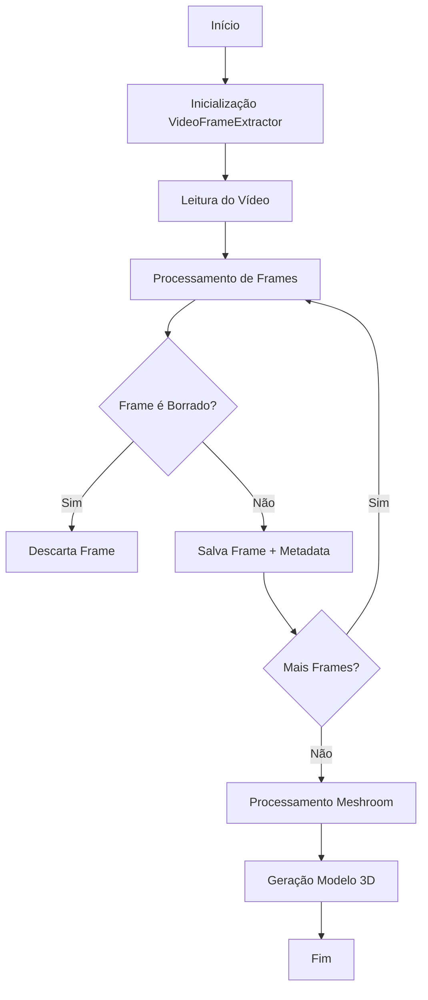

Vou criar uma documentação detalhada com fluxograma do processo de execução do código.

# Documentação do Processo de Extração de Frames e Modelagem 3D

## Fluxograma do Processo



## Detalhamento das Etapas

### 1. Inicialização
- **Entrada de Dados:**
  - Path do vídeo
  - Nome do vídeo
  - Formato do vídeo
  - Path para metadata
  - Path para output 3D

Referência:

```5:13:main.py
def main():
    path_video = "src/tmp/videos"
    name_video = "IMG_1115"
    format = TypeVideos.MOV
    path_image_metadata = "src/tmp/base.JPEG"
    export_img = VideoFrameExtractor(
        path_video, path_image_metadata, name_video, format
    )
    export_img.execute()
```


### 2. Leitura do Vídeo
- Abre o arquivo de vídeo usando OpenCV
- Valida se o vídeo foi aberto corretamente
- Prepara o ambiente para processamento

Referência:

```22:37:src/converter/services/export_img.py
    def execute(self) -> None:
        """Processa o vídeo, extraindo frames e gerando modelo 3D."""
        video_path = os.path.join(
            self.path_video, f"{self.name_video}.{self.format.value}"
        )
        video = cv2.VideoCapture(video_path)
            raise ValueError(f"Não foi possível abrir o vídeo em: {video_path}")
        if not video.isOpened():
            raise ValueError(f"Não foi possível abrir o vídeo em: {video_path}")
            self._process_video_frames(video)
        try:
            output_dir = self._process_video_frames(video)
            self._generate_3d_model(output_dir)
        finally:
            video.release()
            cv2.destroyAllWindows()
```


### 3. Processamento de Frames
- **Para cada frame do vídeo:**
  1. Extrai o frame
  2. Salva temporariamente
  3. Analisa qualidade (blur detection)
  4. Copia metadata se aprovado

Referência:

```39:59:src/converter/services/export_img.py
    def _process_video_frames(self, video: cv2.VideoCapture) -> str:
        output_dir = os.path.join("src/tmp", self.name_video)
        os.makedirs(output_dir, exist_ok=True)
            success, frame = video.read()
        frame_count = 0
        while True:
            success, frame = video.read()
            if not success:
                break
            )
            image_path = os.path.join(
                output_dir, f"{self.name_video}_{frame_count}.jpeg"
            )
            cv2.imwrite(image_path, frame)

            if not self._is_frame_blurry(frame, image_path):
                self._copy_image_metadata(self.path_image_metadata, image_path)
    def _is_frame_blurry(self, image: MatLike, image_path: str) -> bool:
            frame_count += 1
            print(f"Frame vazio detectado em: {image_path}")
        return output_dir
```


### 4. Análise de Qualidade
- Converte frame para escala de cinza
- Calcula score de nitidez (Laplacian)
- Threshold: 90
- Remove frames borrados

Referência:

```61:74:src/converter/services/export_img.py
    def _is_frame_blurry(self, image: MatLike, image_path: str) -> bool:
        if image is None:
            print(f"Frame vazio detectado em: {image_path}")
            return True
        if blur_score <= 90:  # Imagem borrada
        gray = cv2.cvtColor(image, cv2.COLOR_BGR2GRAY)
        blur_score = cv2.Laplacian(gray, cv2.CV_64F).var()
        print(f"Pontuação de nitidez: {blur_score}")
        return False
        if blur_score <= 90:  # Imagem borrada
            os.remove(image_path)
            return True
            exif_data = metadata.read_exif()
        return False
```


### 5. Processamento Meshroom
- Inicializa MeshroomProcessor
- Define diretórios de input/output
- Executa pipeline de reconstrução 3D

Referência:

```7:33:src/converter/services/meshroom_processor.py
@dataclass
class MeshroomProcessor:
    input_directory: str
    output_directory: str
    meshroom_binary: str = "Framework/meshroom_batch"  # Default Meshroom CLI command

    def process_images(self) -> None:
        """Process images using Meshroom to create 3D model"""
        if not os.path.exists(self.output_directory):
            os.makedirs(self.output_directory)

        command = [
            self.meshroom_binary,
            "--input",
            self.input_directory,
            "--output",
            self.output_directory,
        ]

        try:
            subprocess.run(command, check=True)
            print(
                f"3D reconstruction completed. Output saved to {self.output_directory}"
            )
        except subprocess.CalledProcessError as e:
            print(f"Error during Meshroom processing: {e}")
            raise
```


## Resultados e Outputs

1. **Frames Processados:**
   - Localização: `src/tmp/<nome_video>/`
   - Formato: JPEG
   - Nomenclatura: `<nome_video>_<numero_frame>.jpeg`

2. **Modelo 3D:**
   - Localização: `src/tmp/3d_models/<nome_video>/`
   - Gerado pelo Meshroom
   - Inclui:
     - Nuvem de pontos
     - Malha 3D
     - Texturas

## Requisitos do Sistema

1. **Software:**
   - Python 3.11+
   - OpenCV
   - Meshroom instalado
   - PyExiv2 para metadata

2. **Hardware Recomendado:**
   - GPU compatível com CUDA (para Meshroom)
   - RAM: 16GB+ recomendado
   - Espaço em disco suficiente para frames temporários

## Observações Importantes

1. O processo é sequencial e pode ser demorado dependendo:
   - Tamanho do vídeo
   - Quantidade de frames
   - Complexidade da cena
   - Capacidade do hardware

2. Frames borrados são automaticamente descartados para melhorar a qualidade da reconstrução 3D

3. A metadata original é preservada nos frames processados para manter informações de câmera importantes para a reconstrução 3D
